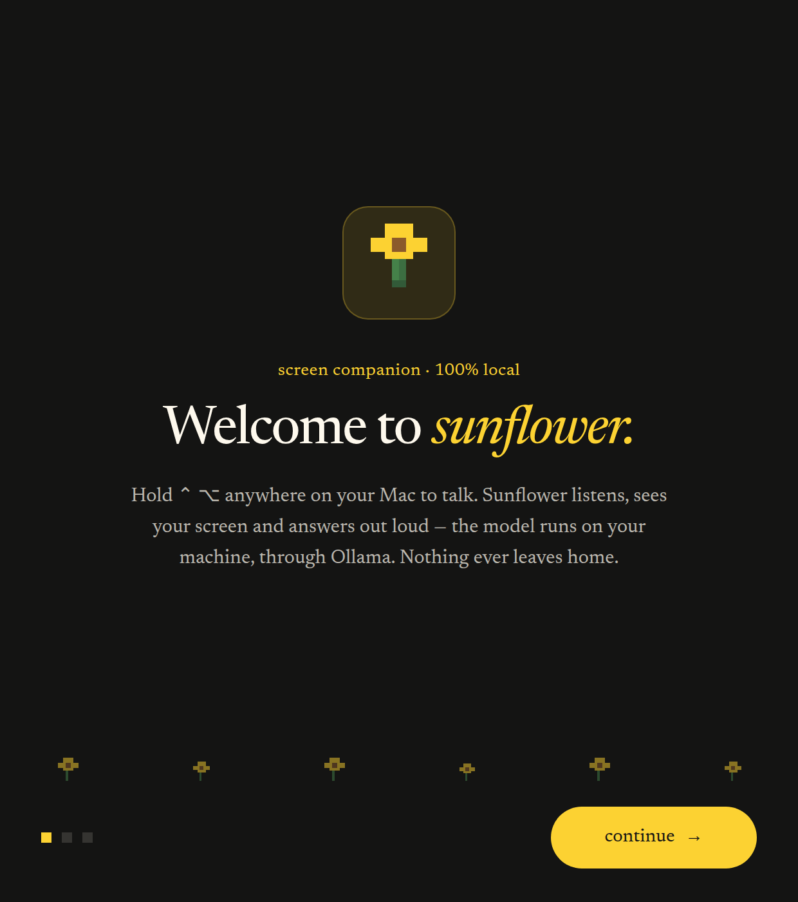
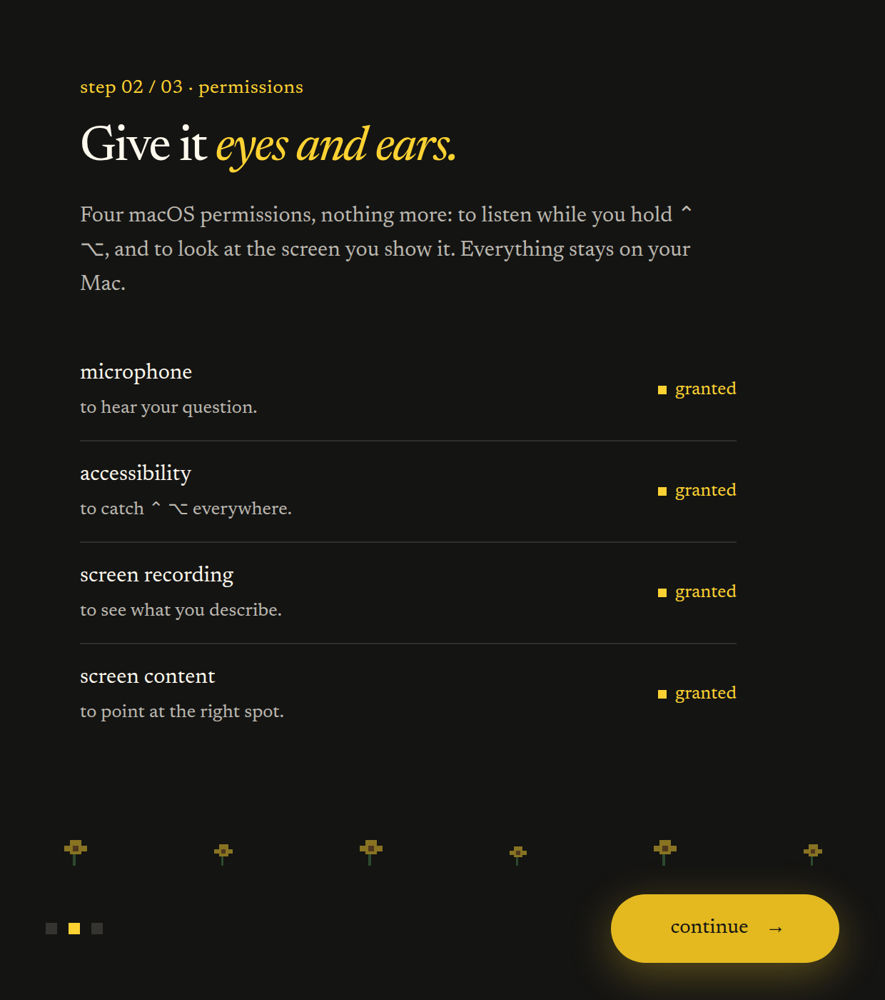
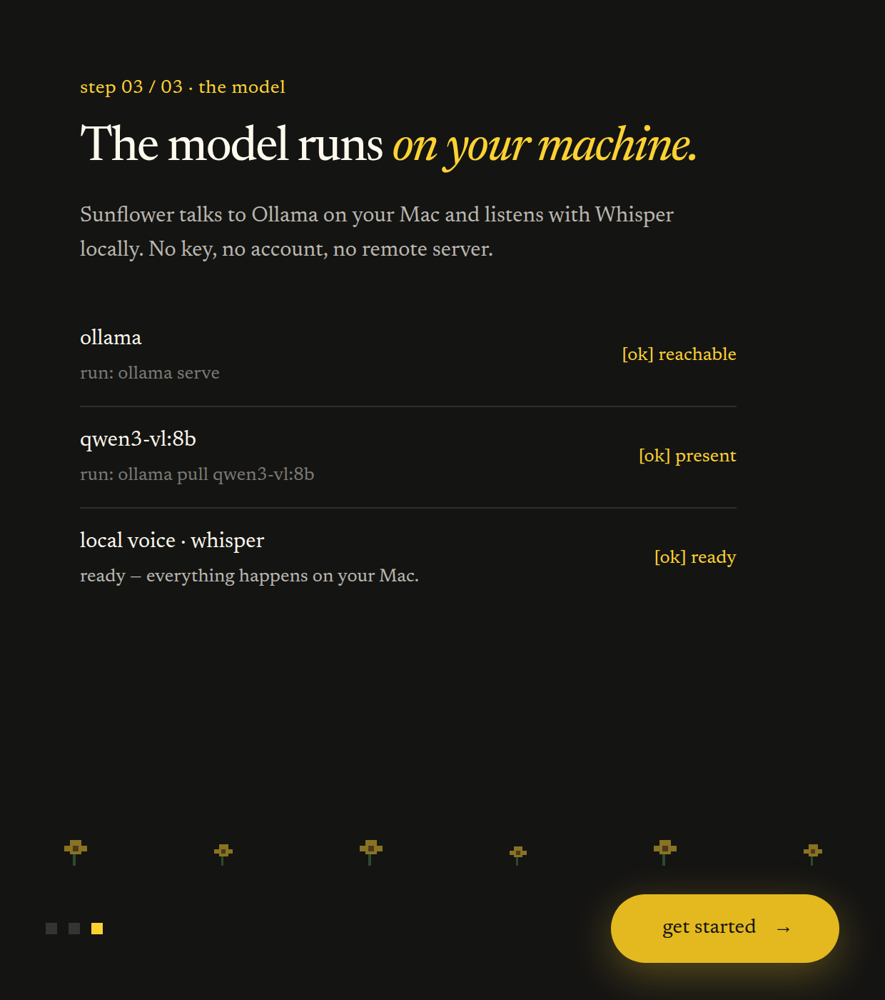
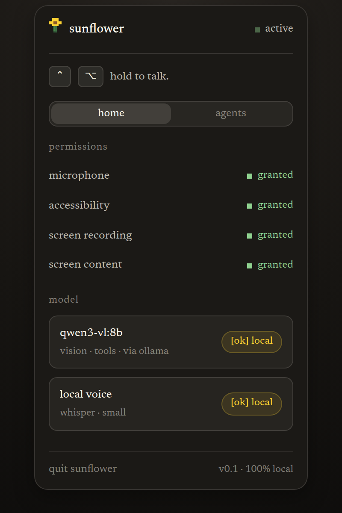
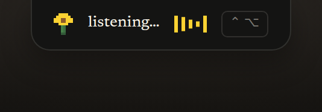
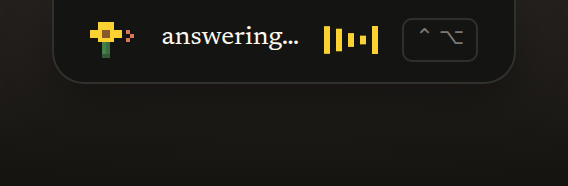
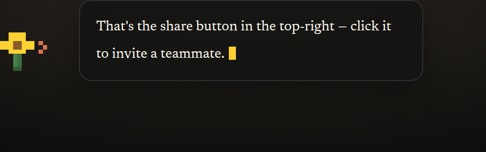

# Sunflower

Sunflower is a macOS screen companion that runs on **local models**. It lives in your menu bar, sees your screen, and answers out loud — and the model doing the thinking runs on your own machine through [Ollama](https://ollama.com). No model provider, no per-token bill, no screenshots leaving your Mac.

Sunflower started as a fork of [Glide](https://github.com/shujanshaikh/glide), which itself started as a clone of [Clicky](https://github.com/farzaa/clicky) by [Farza](https://x.com/FarzaTV). This version replaces the hosted-model backend with local inference.

## What it does

You hold a push-to-talk key and talk. Sunflower captures your screen, sends the image plus your transcript to a local vision model, streams the answer back, speaks it out loud, and can point at things on screen with an on-screen cursor. If you connect external apps through Composio, it can also take action in them.

The backend is a small Hono API running on a Cloudflare Worker. It handles:

- authenticated chat streaming against a **local Ollama** instance (native `/api/chat`)
- listing the models you have pulled locally, with their capabilities
- AssemblyAI realtime transcription token generation
- Gradium text-to-speech proxying
- Composio-powered integrations for connected apps (Notion, Google Docs, Gmail, Slack, GitHub, …)
- Clerk authentication for the macOS app and the server routes

### What runs locally, and what doesn't

Only the **language model** is local. Transcription (AssemblyAI), speech (Gradium), auth (Clerk) and app integrations (Composio) are still hosted services, and each is optional in the sense that the feature it powers simply won't work without its key.

> **Telemetry is opt-in and off by default:** the macOS app inherited the upstream project's PostHog analytics, but it's now gated behind an explicit "Share usage data, including message content" toggle (Home tab of the menu-bar panel), backed by the `analyticsOptIn` UserDefaults key. Until you turn it on, `apps/macos/Glide/GlideAnalytics.swift` never initialises PostHog and never sends an event — every capture call site re-checks the flag, not just setup. When enabled, it shares: app-opened/onboarding/permission-granted milestones, push-to-talk start/stop, your transcribed message and the AI's full response text (each with a character count), which on-screen element got pointed at, and response/TTS error messages — attributed to PostHog's auto-generated anonymous distinct ID, never to your identity. The onboarding flow's old behavior of POSTing the email you enter to the upstream author's personal third-party form endpoint, and of calling PostHog's `identify()` with that raw email, have both been removed entirely — sending PII was never something the opt-in should have gated in the first place, so it's just gone. The PostHog project API key itself is no longer hardcoded: it lives in a gitignored `apps/macos/Config.xcconfig` (see "5. Configure and run the macOS app" below), and if you leave it blank, analytics is a hard no-op — PostHog is never initialised, opt-in toggle or not.

## Architecture

```txt
apps/
  electron/ Electron screen companion "sunflower" — fully local (Whisper + Ollama)
  macos/    Native Swift/AppKit menu bar app
  server/   Hono Cloudflare Worker API
packages/
  config/   Shared TypeScript config
```

The app owns the macOS experience: menu bar UI, push-to-talk, screen capture, voice playback, cursor pointing, auth callbacks. The Worker owns authenticated API access, model streaming, transcription tokens, TTS proxying, and tool integrations.

The app never picks a model — it sends messages and the server decides which Ollama model to use. That keeps model configuration in one place (`OLLAMA_MODEL`) and means you can change models without rebuilding the app.

> **Note on naming:** the Xcode project, scheme and target are still named `Glide`, and the app's URL scheme is still `glide://`. Renaming them is cosmetic and risks breaking the Clerk and Composio redirect flows, so it hasn't been done. Wherever this README says `Glide`, it means the Xcode target.

## Electron app — `sunflower` (100 % local)

`apps/electron` is a second, fully local implementation of the companion, built from the Claude Design prototype in `app-electron-avec-tournesol-local/`. Unlike the Swift app + Worker pair, it needs **no server, no Clerk, no API keys**: push-to-talk (hold ⌃ ⌥) → mic capture → **local Whisper** transcription (whisper.cpp, Metal) → screenshot → **local Ollama** vision model → streamed answer in a speech bubble next to a pixel-art sunflower that follows your cursor, spoken aloud with the macOS system voice. English UI, in the app's black-and-yellow theme.

Surfaces: a status island under the menu-bar notch, the cursor-following sunflower companion with its speech bubble, an orange pointing overlay that frames the one element the model points at — sized to that element's bounding box (see "Pointing" below), a menu-bar tray panel (live permissions, model status, quit), and a 3-step onboarding on first launch.

### Screenshots

The onboarding walks through welcome, permissions, and the local-model check — in the same black-and-yellow theme as the running app:

| Welcome | Permissions | Local model |
| --- | --- | --- |
|  |  |  |

The menu-bar panel shows live permission, model, and voice status:



The status island sits under the notch while sunflower listens and answers, and the cursor-following companion streams the reply in a speech bubble:

| Listening | Answering | Companion |
| --- | --- | --- |
|  |  |  |

### Run it

```bash
pnpm install        # once, at the repo root (builds whisper.cpp — needs Xcode CLT)
npm start           # at the repo root (or in apps/electron)
```

Or install the global command:

```bash
cd apps/electron
npm link
sunflower           # from anywhere
```

Requirements: [Ollama](https://ollama.com) running (`ollama serve`) with a **vision-capable** model pulled. The default is `qwen3-vl:8b`; if it's absent, sunflower automatically uses the first local model with the `vision` capability. The Whisper model (`ggml-small-q5_1`, ~190 MB) downloads once on first launch into `~/Library/Application Support/sunflower/models/`.

macOS permissions (requested during onboarding, all grants go to the Electron binary): microphone, accessibility (global ⌃ ⌥ hotkey), screen recording. Config lives in `~/Library/Application Support/sunflower/config.json` (`ollamaHost`, `ollamaModel`, `whisperModel`); `OLLAMA_HOST` env var overrides the host. Sunflower's own windows are excluded from its screenshots via content protection.

Screen recording has a macOS quirk: its Settings pane only lists an app *after* the app has attempted a capture (there is no "+" button). Sunflower's first "grant" click triggers that attempt so the app registers itself and the system prompt appears; a second click opens the now-populated Settings pane. In dev the entry is named **Electron** (grants go to the Electron binary). After you tick the box, macOS offers to "Quit & Reopen" — choose **Later** and rerun `npm start` yourself, because the auto-relaunch starts a bare Electron without sunflower's app path. The grant survives the relaunch.

### The terminal

When launched from a terminal (`npm start` or `sunflower`), sunflower turns it into a first-class interface:

- A startup banner shows the Ollama host and model, whisper status, and the hotkey — with the fix printed in red when something is missing (`ollama serve`, `ollama pull …`).
- **Type a question at the `❯` prompt** — it takes a screenshot at your cursor and runs the exact same pipeline as voice: the answer streams into the terminal *and* into the companion bubble with speech. Typing works even while whisper is still downloading.
- Voice sessions render live too: `listening…`, `looking at your screen…`, your transcribed question, a spinner while the model thinks, then the streamed answer with its duration.
- On a cold start the spinner says `waking the model…` instead of failing — sunflower preloads the model when the app launches and again the moment you start speaking, and allows up to ~3 minutes for the first token of a cold load.
- **Every 10 000 tokens of context, a fresh chat starts automatically.** The Ollama runner survives from one question to the next (`keep_alive` + prompt cache), and with small local vision models that accumulated state degrades answers over a long session — early questions read the screen perfectly, later ones start hallucinating. Sunflower counts the tokens each answer really consumed (as reported by Ollama) and, past 10k, prints `✦ … starting a fresh chat`, unloads the model — discarding all of its state — and preloads it again in the background while you read the answer.
- **Native whisper.cpp/Metal logs never reach the terminal.** whisper.cpp re-initialises its state (Metal context included) on every transcription and logs the whole process to stderr — dozens of `whisper_*` / `ggml_*` lines per question. The launcher filters them out into `~/Library/Application Support/sunflower/logs/native.log` (rotated at 5 MB) so the terminal only shows the dialogue; anything else written to stderr (real errors) still comes through.
- **Ctrl+C** interrupts the current answer; at an idle prompt it quits the app. Set `SUNFLOWER_DEBUG=1` for full error details and the raw, unfiltered native logs.
- Without a TTY (packaged app, redirected output) all of this degrades to plain `[sunflower]` log lines — nothing else changes.

### Pointing

When pointing at one element genuinely helps the answer, the model ends it with that element's **bounding box** — `[POINT:x1,y1,x2,y2]`, four integers from 0 to 1000 relative to the screen image, the grounding format `qwen3-vl` is natively trained on — and the orange bracket frame **sizes itself to the element** (constant-thickness pixel-art brackets, padded a little, clamped between 60×48 px and 70 % of the screen, and always fully on-screen). Guide steps carry the same boxes: the frame wraps each step's target and the step advances as soon as the cursor enters the box, not just a fixed radius around its center; the companion parks itself clear of wide frames.

Because small local models don't all speak the same coordinate dialect, the parser normalizes whatever comes back: legacy two-number centers (`[POINT:50%,30%]`, shown with the default fixed frame), percentages, 0–1 fractions, and absolute pixels of the captured image are all accepted. What it refuses to do is guess: a marker it can't parse shows nothing (it used to be mangled into a corner), a box covering essentially the whole screen is discarded as noise instead of being drawn, and the prompt now instructs the model to skip the marker entirely when it isn't sure where the element is — no marker is better than a frame around a button that doesn't exist. `SUNFLOWER_DEBUG=1` logs every marker's raw text, the convention detected, and the final frame rectangle, so a bad pointing is diagnosable after the fact.

### Dock mode

Double-click the sunflower, flip the **companion** toggle (**roam** / **dock to corner**) in the menu-bar panel, or use the tray menu (**dock sunflower to corner** / **let sunflower roam**), to pin the companion in one spot instead of having it chase your cursor. Docked, it shrinks to a compact ~110×110 badge parked in the bottom-right corner of the display's work area, with a scaled-down speech bubble above it, so nothing floats over the middle of the screen while you're watching or sharing it. The mode is saved (`companionMode` in `config.json`) and restored on the next launch, and a docked companion re-pins itself to the corner if the display's resolution or scaling changes. The companion window is click-through everywhere except the flower itself — hovering it briefly makes the window interactive so the double-click can land, then releases the instant the cursor leaves, so it never eats a click meant for whatever's underneath.

This shipped alongside a pass on that same tracking loop, prompted by a "this app is heating up my Mac" report: instead of an unconditional 60 fps timer and an unconditional `setBounds` call, the companion now runs at ~30 fps while it's actually moving, drops to ~6 Hz after 3 seconds of cursor stillness, and stops the loop entirely while docked, hidden, or holding still — `setBounds` is skipped outright when the target position hasn't changed. Its decorative animations (the flower's sway, the blinking caret) pause the same way after 60 seconds of idle, and the mostly-hidden pointer overlay now lets Chromium throttle its background timers instead of being exempted like the always-visible island, companion, and agent-orb windows.

### Switching models — `sunflower-models`

A second, standalone CLI for browsing what's pulled locally and changing which model sunflower uses, without opening the app. It's registered as its own bin (`sunflower-models`, picked up by the same `npm link` above) and also reachable as a subcommand of the main CLI (`sunflower models …`), which dispatches to it before any Electron/build logic runs — no build needed either way.

- With no arguments it opens an interactive, arrow-key browser in the same black-and-yellow theme as the app: an **Installed** section (from Ollama's `GET /api/tags` — name, size, parameter count, active model marked) and a curated **Recommended** section — vision models (`qwen3-vl:8b`, `qwen2.5vl:3b`/`7b`, `llama3.2-vision:11b`, `moondream`, `llava:7b`/`13b`, `minicpm-v`) plus text models for the coding agents below (`qwen2.5-coder:7b`, `llama3.1:8b`, `deepseek-r1:7b`/`8b`).
- **Enter** on an installed model makes it active immediately; **Enter** on one you don't have yet pulls it via `POST /api/pull`, with a live progress bar, then offers to make it active.
- `sunflower models --list` — the same two sections as a plain table, no TTY required.
- `sunflower models --pull <model>` / `sunflower models --use <model>` — non-interactive pull / switch, for scripting.
- `sunflower models --help` — usage.

"Active" means the `ollamaModel` field in `~/Library/Application Support/sunflower/config.json` — the same file the app itself reads. The CLI rewrites just that field atomically (temp file + rename), leaving every other field in the file untouched. Any Ollama network failure prints the same `ollama serve` hint as the rest of sunflower and exits non-zero.

### Background coding agents

Sunflower also runs small, **propose-only by default** coding agents against your local text model — the agents tab of the menu-bar panel is a queue of background tasks, each scoped to one project folder. An agent can read files inside that folder (it asks for them by path; it can never read or write outside it), and after a few turns proposes the complete new content of each file it wants to change. **Nothing is written to disk** until you explicitly **accept** or **deny** each proposed file from the review UI, one file at a time — the agent has no other path to your filesystem.

The whole run is **observable live**: model turns stream token by token from Ollama, and clicking a run in the agents tab opens an in-progress view with the live transcript (auto-scrolling unless you scroll up), every file the agent read, and every command it proposed. No more opaque spinner — the panel and the orb reflect each turn as it happens.

**Command execution is opt-in, per run.** A checkbox on the launch form ("allow command execution") lets the agent *propose* shell commands with a `RUN: command` line — to run tests, builds, `git diff`, and so on. Left unchecked (the default), behavior is strictly the historical propose-only flow: no command can ever run. Even when checked, three guardrails stack up: a non-bypassable blacklist refuses obviously destructive patterns outright (`rm -rf`, `sudo`, force pushes, `git reset --hard`, piping downloads into a shell, disk formatting…— the refusal shows in the transcript, never silently); every surviving command **waits for your explicit run/deny click** in the panel, exactly like the per-file accept/deny; and an approved command is spawned with its working directory locked to the run's project folder, a 120 s timeout, and its stdout/stderr streamed live into a terminal view in the panel. (It's a plain `spawn` capture, not a PTY — no native `node-pty` dependency to compile per platform — so interactive progress bars render as plain text.) The command's exit code and output are fed back to the model for its next turn.

While an agent is queued or running, a small pixel-sunflower **agent orb** docks to the right edge of the screen. Hovering it expands a status pill whose text now follows the run's real activity (`turn 3/8 · read src/foo.ts`, `turn 5/8 · writing…`, `running: npm test…`, `command waiting for you`, `review ready`), and the spinning-ring animation only plays while something is actually happening — a model call in flight or a command executing — not for the whole life of the run. Dragging the orb up or down repositions it (the position is remembered across restarts); a plain click jumps straight to the panel's agents tab so you can review or approve.

### Sunflower Work (experimental)

Sunflower can also drive your mouse and keyboard to finish a small computer errand — "archive the newsletters," "close all these tabs," "empty the trash" — instead of just answering or narrating a guide. It's off by default: turn it on from the tray menu (**Enable Sunflower Work (experimental)**, persisted as `sunflowerWorkEnabled`). Ask for something that reads as an errand rather than a question, and the model answers with a short acknowledgement plus an internal `[WORK: …]` marker (never shown or spoken) that hands the task to the work runner; ask with it still off and sunflower just tells you where to flip the switch.

Nothing is touched while you're at the keyboard. The runner watches the same global input hook as the push-to-talk hotkey, requires **20 seconds of real idle** before its first move, gives up quietly if you haven't stepped away within 2 minutes, and — the instant it sees a real keystroke, mouse movement, or the push-to-talk hotkey — aborts on the spot ("you came back — hands off, all yours"). It's macOS-only, and refuses to start at all without the Accessibility permission that input hook depends on, rather than drive blind.

Once you're away it loops: screenshot → one turn of the local vision model, constrained to reply with exactly one JSON action (`click`, `double-click`, `type`, `key`, `wait`, or `done` to end the run) → a real CGEvent/System Events call via `osascript` (no extra dependency) → a 1.5–2.5 second settle pause → repeat, feeding the model a running log of what it's already done. It's bounded on every side — 25 steps max, 90 seconds per model turn, an 8-minute total budget, and it gives up if the model answers off-format more than twice — and its own synthetic input is tagged so the presence guard doesn't mistake it for you coming back. Progress narrates on the status island (`looking at the screen (step 3)…`, each step's short reasoning) and ends with a system notification saying done, stopped, or failed; flipping the tray toggle off cancels any run in progress immediately. The prompt keeps it conservative by design: never open an app it can't see on screen, never touch system settings, never type a password.

### Diagnostics: the watchdog

The Electron app runs a lightweight watchdog alongside everything else: every 5 seconds it samples CPU and memory per-process (`app.getAppMetrics()`) and appends a JSON line to `~/Library/Application Support/sunflower/watchdog/watchdog-YYYY-MM-DD.jsonl` — one file per day, pruned automatically to a few days of history and a few megabytes total. If total CPU usage stays above ~300% (roughly three full cores) for more than 30 seconds it also logs a `warn` line naming every running process, so a "the app is heating up my Mac" report comes with an actual trail — screen capture, whisper.cpp, a stray `BrowserWindow`, Ollama running away with the GPU — instead of a guess. The watchdog never throws, never blocks the app on disk I/O, and never keeps the process alive at quit.

## Prerequisites

- macOS with Xcode installed
- Node.js and pnpm
- [Ollama](https://ollama.com) running locally
- A Clerk application (required — every API route is authenticated)
- Optional, per feature: AssemblyAI (transcription), Gradium (speech), Composio (app integrations)

## 1. Install Ollama and pull a model

```bash
brew install ollama
ollama serve
```

Or download the app from [ollama.com/download](https://ollama.com/download).

Then pull a model. Sunflower's default is `qwen3-vl:8b`:

```bash
ollama pull qwen3-vl:8b
```

**Pick a model with the right capabilities.** Sunflower sends screenshots, so you want a model with `vision`. If you plan to use the Composio integrations, you also need `tools`:

| Model | Vision | Tools | Notes |
| --- | --- | --- | --- |
| `qwen3-vl:8b` | ✅ | ✅ | Default. Good balance of quality and speed. |
| `qwen3-vl:32b` | ✅ | ✅ | Better answers, needs a lot more RAM. |
| `llama3.2-vision` | ✅ | ❌ | Vision only — no app integrations. |
| `gemma3` | ✅ | ❌ | Vision only — no app integrations. |
| `minicpm-v` | ✅ | ❌ | Small and fast, vision only. |

Check what a model actually supports:

```bash
ollama show qwen3-vl:8b
```

A model without `vision` will not be able to see your screen. A model without `tools` will ignore the connected-app integrations.

## 2. Install dependencies

```bash
pnpm install
```

## 3. Configure the Worker

Create `apps/server/.dev.vars`:

```bash
# Required — every route is behind Clerk
CLERK_SECRET_KEY=...
CLERK_PUBLISHABLE_KEY=...

# Optional, per feature
ASSEMBLYAI_API_KEY=...   # /transcribe-token
GRADIUM_API_KEY=...      # /tts
COMPOSIO_API_KEY=...     # app integrations

# Optional TTS tuning — defaults live in wrangler.toml
GRADIUM_TTS_MODEL=default
GRADIUM_TTS_VOICE_ID=...

# Ollama — defaults also live in wrangler.toml
OLLAMA_HOST=http://localhost:11434
OLLAMA_MODEL=qwen3-vl:8b
OLLAMA_NUM_CTX=32768
```

The Ollama settings are plain vars, not secrets, so they are already in `apps/server/wrangler.toml` with the defaults above. Only override them in `.dev.vars` if you want different values locally.

### About `OLLAMA_NUM_CTX`

Ollama defaults to a 4096-token context window. A screenshot plus Sunflower's agent instructions blows straight through that, and the result is silent truncation — the model behaves as if it never saw part of your screen. Sunflower therefore always sends an explicit `num_ctx`, defaulting to 32768.

If you have limited RAM, lower it (`16384`). If you send large screenshots or hold long conversations, raise it — but the ceiling is whatever the model itself supports, and a larger window costs memory.

## 4. Run the Worker

```bash
pnpm run dev:server
```

It listens on `http://localhost:8787`.

## 5. Configure and run the macOS app

The app reads these values from Xcode build settings, injected into `apps/macos/Glide/Info.plist`:

```txt
GLIDE_SERVER_BASE_URL   # e.g. http://localhost:8787
CLERK_PUBLISHABLE_KEY   # must match the Clerk app the server uses
CLERK_CALLBACK_SCHEME   # usually glide
CLERK_REDIRECT_URL      # usually glide://callback
```

If `GLIDE_SERVER_BASE_URL` is unset, the app falls back to `http://localhost:8787`.

`CLERK_PUBLISHABLE_KEY` and `DEVELOPMENT_TEAM` (your Apple Developer Team ID, used for code signing) are **not** committed — they live in a gitignored `apps/macos/Config.xcconfig` that the `Glide` target's Debug and Release build configurations load as their base configuration. Without that file the build fails immediately (`Config.xcconfig: No such file or directory`) instead of silently signing with, or authenticating against, someone else's credentials.

Set it up:

```bash
cd apps/macos
cp Config.xcconfig.example Config.xcconfig
```

Then edit `Config.xcconfig` and fill in:

- `CLERK_PUBLISHABLE_KEY` — the publishable key from the same Clerk application as your server's `CLERK_SECRET_KEY`. Using a different Clerk app's key means every server call 401s.
- `DEVELOPMENT_TEAM` — your Apple Developer Team ID (Signing & Capabilities > Team in Xcode, or [developer.apple.com/account](https://developer.apple.com/account) under Membership). A free personal team works for local development.
- `POSTHOG_API_KEY` — optional, and only relevant if you want the opt-in analytics described above to actually go somewhere. Leave it blank to keep analytics a hard no-op regardless of the in-app toggle, or fill in your own PostHog project's key to collect those events yourself.

`Config.xcconfig.example` documents each key, including the optional `GLIDE_SERVER_BASE_URL` override.

Then:

```bash
open apps/macos/Glide.xcodeproj
```

1. Select the `Glide` scheme.
2. Confirm your signing team under Signing & Capabilities matches `DEVELOPMENT_TEAM`.
3. Cmd + R.

Sunflower appears in the menu bar. Sign in, grant the screen-recording and microphone permissions it asks for, and hold your push-to-talk key.

## API

| Method | Route | Purpose |
| --- | --- | --- |
| `POST` | `/chat` | Streaming chat. Accepts an optional `model` to override `OLLAMA_MODEL` for that request. |
| `GET` | `/models` | Models pulled locally, with capabilities and the configured default. |
| `POST` | `/tts` | Gradium text-to-speech proxy. |
| `POST` | `/transcribe-token` | Short-lived AssemblyAI streaming token. |
| `POST` | `/integrations/statuses` | Which toolkits are connected. |
| `POST` | `/integrations/:toolkit/connect` | Create a Composio connection link. |
| `DELETE` | `/integrations/:toolkit/disconnect` | Remove connected accounts for a toolkit. |

All routes require a Clerk session token.

`GET /models` exists so a client can build a model picker without hardcoding a list. It returns the capability flags Ollama reports, so a UI can, for example, grey out models that can't see images:

```json
{
  "defaultModel": "qwen3-vl:8b",
  "models": [
    {
      "id": "qwen3-vl:8b",
      "name": "qwen3-vl:8b",
      "family": "qwen3vl",
      "parameterSize": "…",
      "quantization": "…",
      "contextLength": 0,
      "sizeBytes": 0,
      "capabilities": { "completion": true, "vision": true, "tools": true, "thinking": true }
    }
  ]
}
```

(`parameterSize`, `quantization`, `contextLength` and `sizeBytes` are whatever your Ollama reports for the models you actually have.)

It returns `503` if Ollama isn't reachable and `502` if Ollama answers with an error. Note it sits behind Clerk like every other route — for an unauthenticated setup-time check, ask Ollama directly: `curl http://localhost:11434/api/tags`.

## App integrations with Composio

The server uses `@composio/core` with the Composio Vercel provider. When a signed-in user asks for something that involves an external app, the server looks up that user's connected accounts and loads the relevant toolkit tools into the `streamText` call. Tools are only loaded when the request actually calls for external-app work.

Composio OAuth returns to the app via:

```txt
glide://composio/callback
```

Allow that redirect URL wherever your Composio setup requires it.

Remember that this path needs a model with `tools` support. With a vision-only model, chat and screen understanding work fine and integrations are simply ignored.

## Deployment

Sunflower is built around a local Ollama, and `localhost` means something different inside a deployed Cloudflare Worker than it does on your Mac. Two options:

**Run the Worker locally (recommended).** `pnpm run dev:server` on the same machine as Ollama. Everything stays on your Mac.

**Deploy the Worker and expose Ollama.** Point `OLLAMA_HOST` at an Ollama instance the Worker can reach over the network — a tunnel, or a machine you control:

```bash
pnpm run deploy:server
cd apps/server
npx wrangler secret put CLERK_SECRET_KEY
npx wrangler secret put CLERK_PUBLISHABLE_KEY
npx wrangler secret put ASSEMBLYAI_API_KEY
npx wrangler secret put GRADIUM_API_KEY
npx wrangler secret put COMPOSIO_API_KEY
```

Set `OLLAMA_HOST` in `wrangler.toml` under `[vars]`. (If you'd rather store it as a secret because the URL is sensitive, you must also **delete** the `OLLAMA_HOST` line from `[vars]` — a plain var with the same name overrides the secret on every deploy.)

If you do this, **put authentication in front of Ollama.** The Ollama API has no auth of its own — anything that can reach it can use your GPU and read your prompts. Never expose port `11434` directly to the internet.

## Scripts

- `pnpm run dev` — start all configured apps
- `pnpm run dev:server` — start the Worker locally
- `pnpm run check-types` — TypeScript checks
- `pnpm run deploy:server` — deploy the Worker

## Troubleshooting

**Answers ignore what's on screen.** The model probably has no `vision` capability — check `ollama show <model>`. If it does, `OLLAMA_NUM_CTX` may be too small for the screenshot.

**Integrations never fire.** The model has no `tools` capability. `ollama show <model>` will tell you.

**First reply is very slow.** Ollama loads the model into memory on first use. The Electron app now preloads it at launch and when you start speaking, shows `waking the model…` while it loads, and waits up to ~3 minutes for a cold first token (45 s once warm). If it still times out — `the model is still loading` — warm it manually with `ollama run <model>` or switch to a smaller vision model such as `minicpm-v`.

**The app connects but answers come back empty.** `/chat` checks Ollama before it starts streaming, so the two most common causes now come back as a normal HTTP error instead of an empty answer: `503` means it can't reach Ollama at all (not running, wrong `OLLAMA_HOST`); `404` means Ollama is up but the requested model has never been pulled (`OLLAMA_MODEL` names a model you don't actually have — Ollama does not pull on demand). Either way the response body is `{ "error": "…" }` with Ollama's own message where there is one (e.g. `model 'qwen3-vl:8b' not found, try pulling it first`).

If Ollama instead fails *after* streaming has already started — it goes away mid-answer, the model gets unloaded concurrently, or you cancel the request — `/chat` has already committed to HTTP 200, so the failure travels inside the stream as an AI SDK `error` chunk (`{ "type": "error", "errorText": "…" }`) instead of a response status. The macOS app now surfaces this instead of leaving you with dead air: `AISDK.swift` recognizes the `error` event type, extracts `errorText`, and throws it up to `CompanionManager`, which shows the message in the companion's response bubble near the cursor and speaks it (a short "sorry, i ran into a problem answering that" if the error text is long, the message itself if it's short). The Electron app doesn't go through this Worker/AI SDK path at all — it talks to Ollama's native `/api/chat` directly — but hits the same class of mid-stream failure and handles it the same way in spirit: it watches for an `error` field in Ollama's own NDJSON stream and, when it finds one, surfaces a red `[!!]` banner in the status island (auto-clearing after a couple of seconds) plus an `[sunflower] error: …` line in the terminal. Either way, check the Worker logs (`pnpm run dev:server` prints the Ollama error, e.g. `model 'qwen3-vl:8b' not found`), confirm Ollama is up (`curl http://localhost:11434/api/tags`), and confirm `OLLAMA_MODEL` names a model you have actually pulled.

**Everything returns 401.** Clerk keys in `.dev.vars` and in the Xcode build settings must come from the same Clerk application.

## License

MIT — see [LICENSE](LICENSE).
